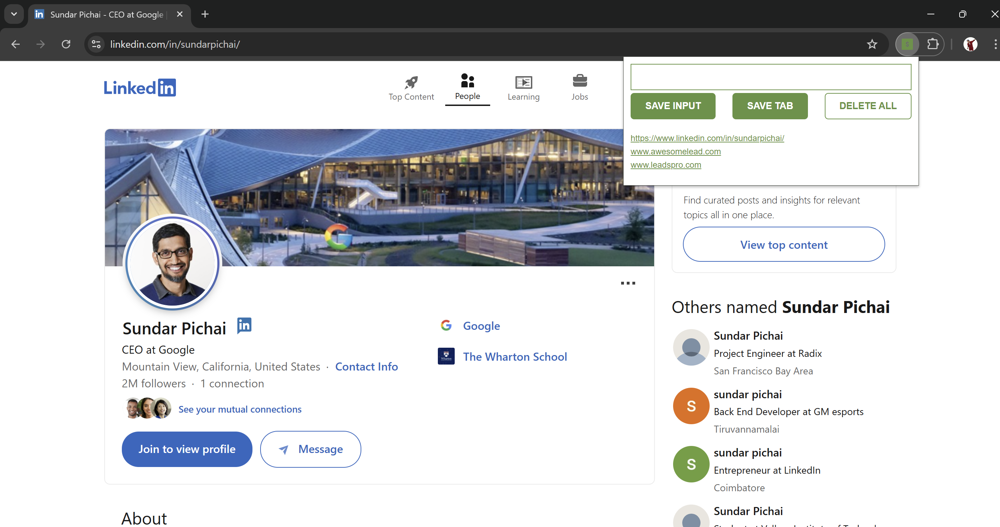

# 📌 Leads Tracker (Chrome Extension)

A simple and lightweight Chrome Extension that helps you **save and manage leads/links** easily. You can manually add URLs, save your current browser tab, and delete all saved leads when no longer needed. All data is stored in your browser’s **localStorage**, so your leads remain available even after closing Chrome.

## 🚀 Features
-  Save input links manually  
-  Save the current browser tab with one click  
-  Persistent storage using localStorage  
-  Delete all saved leads with a double click  
-  Clean and minimal user interface

## 📸 Screenshot


## 🛠️ Installation

1. Clone this repository or download the ZIP file.
   
   ```bash
   git clone https://github.com/aditi-jadhav-arch/leads-tracker.git
   ```
2. Open Google Chrome and go to: chrome://extensions/
3. Enable Developer mode (toggle in the top-right corner).
4. Click Load unpacked and select the project folder.
5. The Leads Tracker extension will now appear in your Chrome toolbar!

## ⚙️Usage
- Type a link in the input box and click SAVE INPUT
- Click SAVE TAB to save the currently active tab’s URL
- Double-click DELETE ALL to clear your saved leads
- Click any saved lead to open it in a new tab
